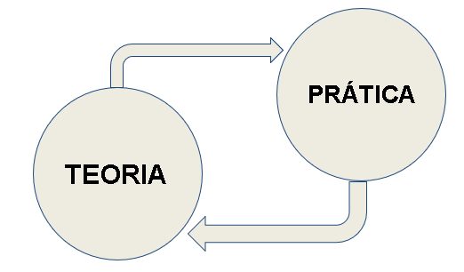

# Bem vindo disciplina de ML

Olá pessoal, bem vindos!! Neste repositório você irá encontrar alguns conteúdos ministrados em sala de aula assim como os atividades e laborórios. 

Repositório com todos os arquivos está disponivel em: [https://github.com/arnaldojr/ml/](https://github.com/arnaldojr/ml/)

Prof. Arnaldo Viana

## Objetivos

Ao final da disciplina o aluno será capaz de:

- Compreender os conceitos de Análise de dados, Machine Learning e Deep Learning
- Conhecer os principais algoritmos de ML
- Desenvolver pequenos projetos envolvendo ciência de dados e Machine Learning.

## O que preciso saber para acompanhar esse curso?

Não há pré-requisitos, os tópicos são abordados e explicados durantes os laboratórios.  

## Dinâmica das aulas:

As aulas estão divididas em pequenos laboratórios, cada lab. possui os seus objetivos especificos. Durante as aulas são abordados teorias e práticas através de desafios.

## O que preciso instalar para acompanhar esse curso?

Vamos trabalhar basicamente com scripts em python que podem ser executados localmente ou em nuvem. 

Como sugestão de instalação local:

* [Python 3.x](https://www.python.org).
* [Jupyter Notebook](https://www.jupyter.org).
* [Anaconda](https://www.anaconda.com).

Em nuvem:

* [Google Colab](https://colab.research.google.com).
* [Kaggle](https://kaggle.com).

## Idéias de projetos

As aplicações são vastas e diversas... Para ajudar a despertar a curiosidade, pense de que forma podemos utilizar ML para resolver um problema do nosso dia a dia.